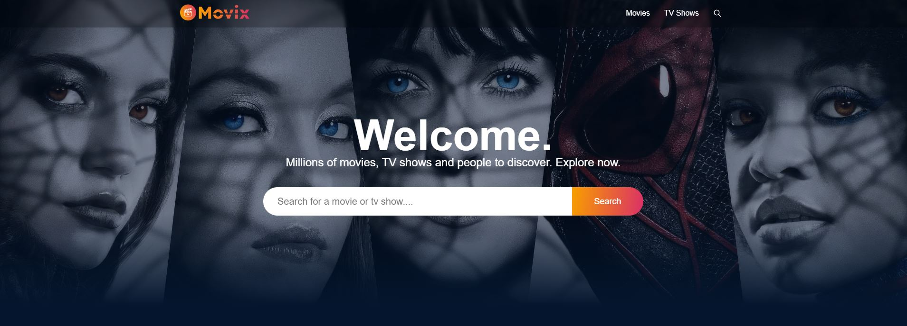
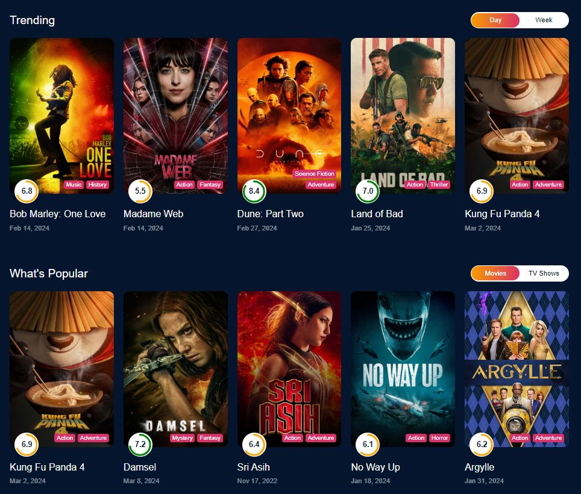
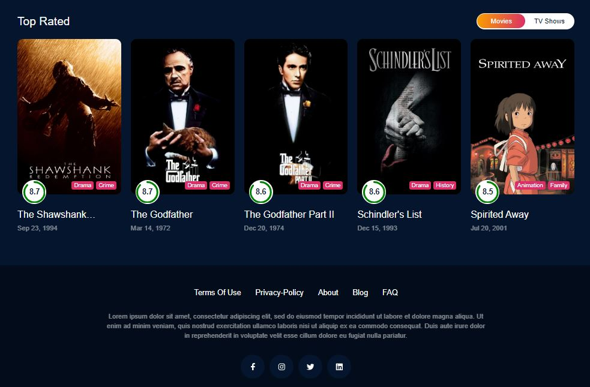
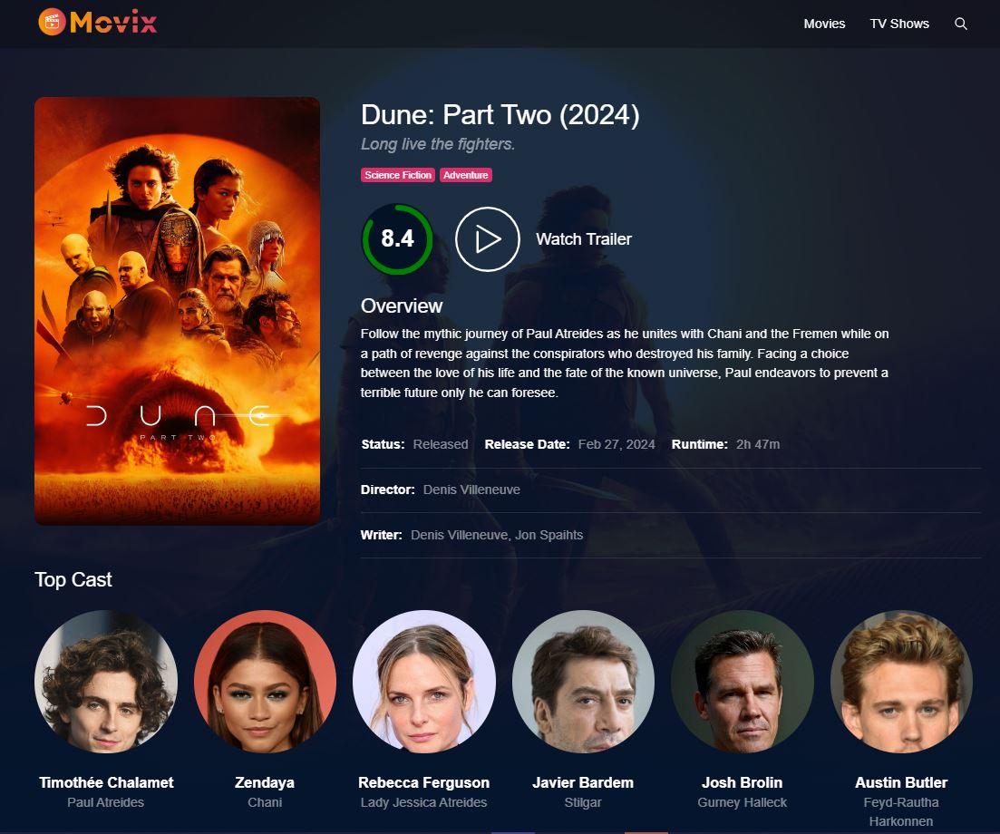
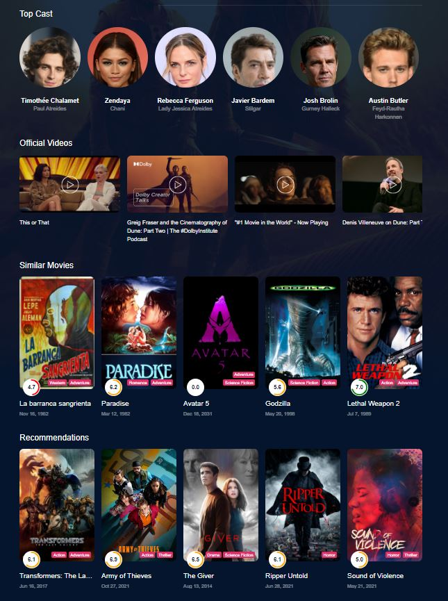
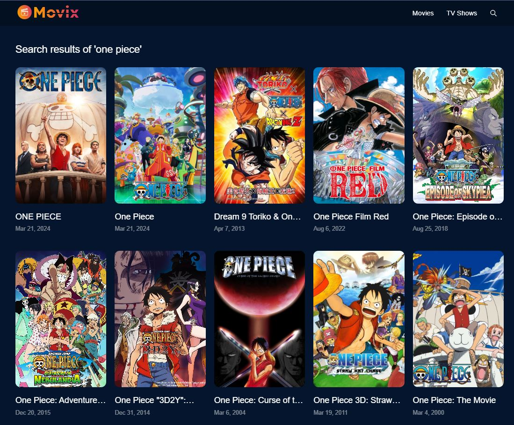
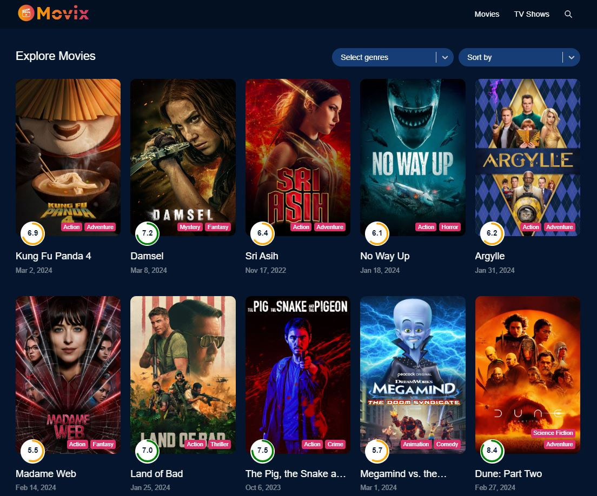
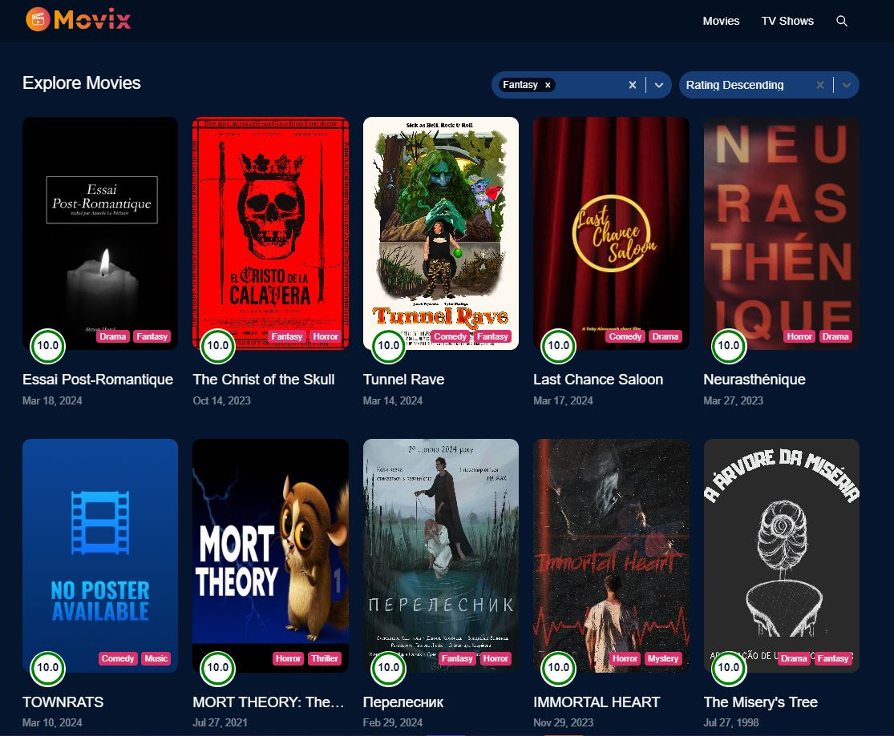

<h2 align="center">
<strong color="green">Movix-App</strong> - Millions of movies, TV shows and people to discover</h2>

<p align="center"></p>

<p>Experience the next level of entertainment with Movix, Built with React, Redux, and a plethora of advanced features, Movix offers unparalleled user-friendliness and responsiveness. Seamlessly search for any movie or TV series, filters based on genres and ratings. Discover trending and upcoming releases sorted for daily and weekly exploration. Easily explore detailed info, trailers, and related videos for every title.</p>

<h3 color="green">📝 Features</h3>

- <strong>Search (Movie and TV Shows)</strong>: Users can effortlessly search for movies and TV shows by their names.

- <strong>Movie and TV Shows (Popular, Trending, and Upcoming):</strong>: On the homepage, you'll find popular, trending, and upcoming movies and TV shows listed with their names, posters, genres, and ratings.

- <strong>Detailed Movie/TV Show Pages</strong>: When you click on a movie or TV show, you'll get a detailed page with everything you need to know: cast, runtime, release year, rating, director, writer, description, trailer, and more videos.

- <strong>Recommendations (Movie and TV Shows)</strong>: Users get suggestions for similar movies and TV shows based on what they're watching.

- <strong>Fine-Tuned Filters</strong>: Users can easily filter their search results by genre, release date, rating, and more to find exactly what they're looking for.

<h3 color="green">🚀 Live Demo</h3>

[https://movix-six-weld.vercel.app/](https://movix-six-weld.vercel.app/)

<h5 color="green">Tending, Popular and Top Rated Movies:</h5>




<h5 color="green">Movie Details Page:</h5>



<h5 color="green">Official Video, Similar TV shows, Recommendations:</h5>



<h5 color="green">Search Results Page:</h5>



<h5 color="green">Explore Movies & TV Shows:</h5>




<h3 color="green">🛠️ Installation Steps:</h3>

<p>1. Clone the repository</p>

```
git clone https://github.com/bijoy172/movix.git
```

<p>2. Install the required dependencies </p>

```
npm install
```

<p>3. Start the development server</p>

```
npm run dev
```

<p>4. Access the application at</p>

```
http://localhost:5173/
```

<h3 color="green">💻 Built with</h3>

Technologies used in the project:

- [React](#) - Building user interfaces
- [Redux](#) - UI state management
- [scss](#) - For styling
- [Axios](#) - API requests to the TMDB API
- [React Router](#) - Navigation and routing within the application

<h3 color="green">🙏 Acknowledgments</h3>

In building Movix-App, we want to extend our thanks to the following tools and resources that played a huge role in making our app awesome:

- **React (`react`) and React DOM (`react-dom`):** These are the main engines behind our app's dynamic interface and component rendering.

- **React Circular Progressbar (`react-circular-progressbar`):** This cool feature adds visually appealing circular progress bars to Movix.

- **React Icons (`react-icons`):** It's a collection of icons that jazz up our interface and make it more engaging.

- **React Infinite Scroll Component (`react-infinite-scroll-component`):** This makes scrolling through content seamless and intuitive.

- **React Lazy Load Image Component (`react-lazy-load-image-component`):** It helps our app load images more efficiently, making everything faster.

- **React Player (`react-player`):** With this, we smoothly integrate media players for showcasing trailers and videos.

- **React Redux (`react-redux`):** It's what we use to manage our app's state, making everything predictable.

- **React Router DOM (`react-router-dom`):** This makes navigating through our app super smooth and easy.

- **React Select (`react-select`):** It's what powers our dropdown menus, making search functionalities better.

- **Redux Toolkit (`@reduxjs/toolkit`):** This toolset makes managing app state with Redux a breeze, saving us from writing a ton of code.

- **Axios (`axios`):** It's a reliable tool for fetching data from the TMDB API, ensuring our app runs smoothly.

- **Day.js (`dayjs`):** This library helps us with date and time formatting, making things look neat.

- **Sass (`sass`):** It's what we use to style our app, making it look sleek and stylish.

<h3 color="green">⚠️ Disclaimer</h3>

Movix uses the TMDB API to gather movie and TV show data. The accuracy, completeness, and availability of this data depend on TMDB's policies and may change over time. Users should refer to TMDB's API documentation and terms of use for any restrictions or guidelines regarding the data accessed through the API.

<h3 color="green">💖Like my work?</h3>

If you enjoy using Movix, please show your support by leaving a star ⭐️ on the project. Thank you! Don't forget to leave a star ⭐️.
